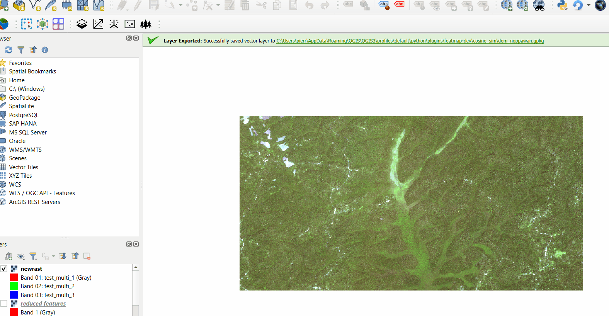
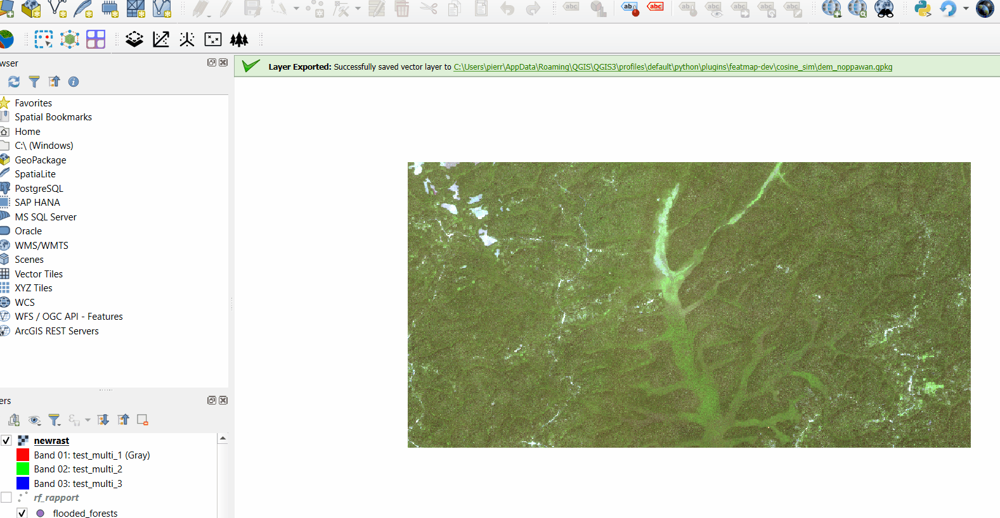
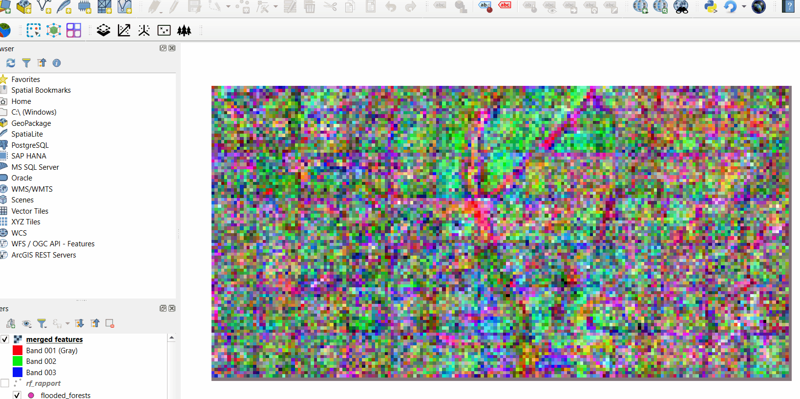
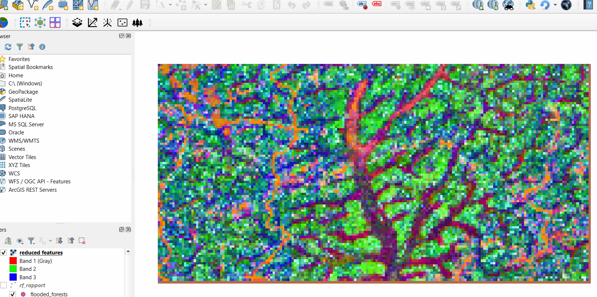

.. |sim| image:: _static/animation_cosine_sim.gif
    :alt: Description of the image
    :width: 400px
    :align: middle

.. |RF| image:: _static/animation_rf.gif
    :alt: Description of the image
    :width: 400px
    :align: middle

Tools
===================

Introduction
---------------------
This section aims to provide the user with an explanation of the different tools at his disposal.

Encoder
---------------------
The first of the options we wanted to develop in the plug-in is the choice of
encoder architecture. It is in fact useful to be able to change models easily, in order to
compare their respective performances on different datasets.

The aim of this work is to make the plug-in flexible and versatile. We have therefore
coded general functions that can be used with almost any type of encoder. We use
models available on `timm <https://huggingface.co/timm>`_, an online library referencing
different deep learning models. We are in particular interested in the use of backcone (encoder).
Those backbones produce matrices of features (mathematical image descriptors). Our functions then take into account
dimensions of these matrices to enable them to be processed by the plug-in.

The output will be a feature map, where each patch of C*C pixels (depending on the encoder) will be represented by an array of N dimensions (depending
on the encoder).

The following animation shows how to use this tool of the plug-in :

    |encoder|

Backbone choice :
^^^^^^^^^^^^^^^^^^^^^
This option enables one to use the backbone of his/her choice from timm librairy. However be careful if you use Windows and you want to try a new backbone,
you need to create it one time in OSGeo4W shell before running it via the plug-in. You can use the following code snippet to do that (assuming that you have an environment
where timm librairy is installed) :

  ::

    python()
    import timm
    model = timm.create_model(model_name, pretrained=True)

Stride :
^^^^^^^^^^

this option allows the use of a stride, which is a sliding window. It should never be bigger than the sampling size used. Otherwise you will encounter either errors or gaps in the features produced.
If the stride is the same as sampling size, patches will not overlap. This is the most standart option.
If the stride is inferior to the sampling size, patches will overlap. You can then use the "Merge method at the end of inference" option in "advanced parameters"
to determine how the features of the overlapping patches will be computed.

Dimension reduction 
---------------------
This tool was thought to allow the dimension reduction of a geotiff file. It can be used on an original image, or on the features map produced
by a deep learning encoder.
This tool serves two main features. The first one is to allow a good visualization of a tiff file by reducing the number of dimensions to 3
(which will be attributed to the colors red, green and blue). This makes sense in order to visualize the features map produced by a deep learning
encoder, ot to visualize a multipectral image by resuming it's spectral information into three main canals.

This animation explains how to do it :
    |dim_red|

The second features is to use machine learning algorithm from the features map produced by an encoder. Some machine learning algorithm 
(such as bagging algotihm) are known to be inneficient with very high dimensional date (in particular due to a problem of over fitting).
It can be then useful to reduce the dimension of the feature map produced by an encoder to 20 or 30... before applying such algorithm.

This animation explains how to do it :
    |dim_red_feat|

Several options are at disposal for dimension reduction. The two main ones are PCA (cite) and UMAP (cite).
While PCA is the simplest one as far as mathematical interpretation and computation time are involved, it should be remebered that this
dimension reduction technique only takes into account linear dependencies between the dimensions of the image. 
UMAP on the other hands take much more time to compute, but can lead to better representation of the original axis, especially for high dimensional
data (for example, on a feature map).

Clustering 
---------------------
This option allows one to cluster a geotiff file.
This clustering is based on the K-means method using euclidian distance. The number of clusters wanted needs to be provided.

This animation shows ho to use it :

    |Kmeans|

Similarity research
---------------------
The similarity research can be used in order to detect similar features in an image. This research is based on cosine similarity. It can be 
used with the original image, but it tends to works best with the feature map of the image, as cosine similarity is thought to process high-dimensional
data. 

The user should provide a point (or an array of points) in the form of a .gpkg file (input shapefile for similarity option). Then the cosine similairty will be processed computing
the cosine between the vector representing the pixel containing the point (or the patch containing the point in case of using it on a features map)
and the vector representing all the other pixels (or patches) of the image. If an array of point is specified, the algorithm will compute the average vector
reprensenting those point before processing as before. 

This animation shows how to use this tool :

    |sim|

Random Forest
---------------------
This tool is a random forest classifier.
You can provide a train data set of points and a test data set of points in the form of a .gkpg file. An accuracy mesure will
be computed representing the porcentage of points in the test data set correctly predicted.

If you provide only one data set (leaving test data set option empty), this data set will be randomly divided into a train and test part. 80% of the points
will be randomly selected for training, and the rest of them will be used for testing.
You need to specify the name of the column you want the random forest to use as objective variable. If you use two distincts datasets to test
and train make sure they have the same columns names.

After the execution of the algorithm, the random forest map will be generated.

This animation shows ho to use this tool :

    |RF|
