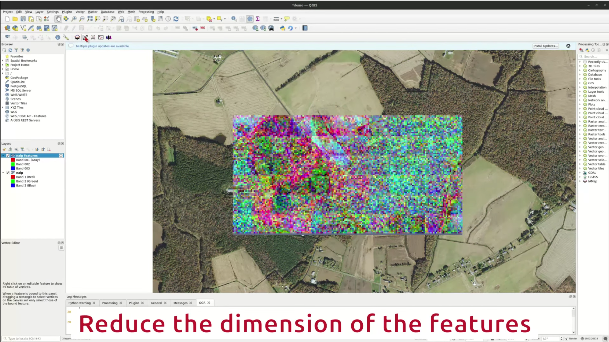

# Tools

This section describes the different tools available in the plugin.

---------------------------------------
## Encoder

```{image} ../../icons/encoder.svg
:alt: Encoder icon
:class: centered-image
:width: 100px
:align: center
```

This tools enables the encoding of an image with a deep learning backbone.
Projecting an image through a deep learning backbone can indeed help bypass color, shadows or texture artefacts that make an object hard to detect otherwise.
We have coded this plugin with Vision Transformers (ViTs) in mind as backbones because they have become the state of the art in computer vision since 2021.
Modern deep learning backbones are pretrained in a Self-Supervised maner and can provide meaningfull descriptors of an image without further training.
Here, we rely on the [timm](https://huggingface.co/timm) library to download and use pre-trained models. This library is widely used in the deep learning community and regularly updated.
After being fed to the model, we save the outputed features produced by the model. Hopefully, these features can represent the image in a new feature space that is more informative and discriminant to help with further mapping.
Generally with ViTs, the resulting spatial resolution is coarser than the input resolution (_e.g._ for a ViT Base, 16x16 pixels become a single pixel).

### Encoding process

GIS raster images are usually too big to be fed in a deep learning backbone. Therefore, we tile the input image and each tile is fed to the backbone.
There is two major parameters you can set : `size` and `stride`. The original image will be sampled in tiles of `size x size` pixels with the given stride.
Then, if the stride is smaller than the size, there will be an overlap between tiles. If stride is equal to the size, it will be a perfect grid. If the stride is bigger than the size, if will probably not work properly !

Do keep in mind that before passsing through the model, the sampled tile will be resized according to the expected input size from the model.

During encoding, each tile is saved on disk and the tiles are merged regularly to save space. We chose to save on disk to be easier on ram an leave the option to stop the process and restart later.
By default, features are saved in a temporary directory but you can change the target location.

Encoding sessions are identified with a [md5 sha](https://en.wikipedia.org/wiki/MD5) so a set of input parameters is unique and can be recognised. This allows to easily start again where you left of.
The parameters corresponding to a sha are saved in the `parameters.csv` files in the target directory.

The backend for handling datasets and dataloader is a fork from [torchgeo](https://torchgeo.readthedocs.io/).

<!-- (!video)[./_static/encoder.webm] -->
[](./_static/encoder.webm)


### Backbone choice

We have pre-selected a couple of backbones that are often used in computer vision.
However, if you input the name of another timm or huggingface backbone in the field below, this will be the used one.

### Using a custom backbone

If you have a pretrained backbone, you can give a path to the weights in the corresponding field and this will be the backbone used for encoding.


---------------------------------------
## Dimension reduction 

```{image} ../../icons/proj.svg
:alt: Reduction icon
:class: centered-image
:width: 100px
:align: center
```

The features produced by a deep learning encoder are often of high dimensionality (_e.g._ 768 dimensions for a ViT base).
However, it can be cumbersome to deal with all these features and this high dimensionality feature space, especially when a majority are not really informative.
Therefore, it is possible to reduce the dimensions of a raster using a variety of algorithms.
We chose to rely on [scikit-learn](https://scikit-learn.org/) to provide the algorithms.
All algorighms available in the [decomposition](https://scikit-learn.org/stable/api/sklearn.decomposition.html) and the [cluster](https://scikit-learn.org/stable/api/sklearn.cluster.html) module that share a common API can be used.

Different algorithms have different arguments that can be passed. You can provide these as a json string in the corresponding field.

> Not all of the algorithms have been tested and some may be heavy on computing or need particular input types.

[](./_static/proj.webm)


---------------------------------------
## Clustering 

```{image} ../../icons/cluster.svg
:alt: Clustering icon
:class: centered-image
:width: 100px
:align: center
```

Features or reduced features can be clustered (_i.e._ unsupervised classification) using algorithms form the scikit-learn [cluster](https://scikit-learn.org/stable/api/sklearn.cluster.html) module that share a common API.

Different algorithms have different arguments that can be passed. You can provide these as a json string in the corresponding field.

> Not all of the algorithms have been tested and some may be heavy on computing or need particular input types.

[](./_static/cluster.webm)

---------------------------------------
## Similarity

```{image} ../../icons/sim.svg
:alt: Similarity icon
:class: centered-image
:width: 100px
:align: center
```

A good way to compare two points in a high-dimension setting is through [cosine similarity](https://en.wikipedia.org/wiki/Cosine_similarity).
This measure will be equall to one for vectors having the same coordinates and 0 for orthogonal vectors. Thus, the closer to one the cosine similarity is, the more similar two points should be.

Here, additionnaly to an input raster, you have to provide a shapefile (or any format that will be read by geopandas) that will serve to prodive reference point(s).

> If the geometry of your input is not points, it will automatically be sampled as points. You can check the sampling rate in the options.

[](./_static/sim.webm)

---------------------------------------
## Machine Learning Algorithms

```{image} ../../icons/forest.svg
:alt: Machine learning icon
:class: centered-image
:width: 100px
:align: center
```

If the features you have seem informative, you can fit a Machine Learning model on it by providing ground truth points.
Thus, you have to provide an input shapfile (or any format that will be read by geopandas) and the column corresponding to the ground truth values.
Based on the algorithm you choose, these values will be interpreted as integers (classification) or floats (regression).
All models provided by scikit-learn [ensemble](https://scikit-learn.org/stable/api/sklearn.ensemble.html) (_e.g._ Random Forests, Gradient Boosting) and [neighbors](https://scikit-learn.org/stable/api/sklearn.neighbors.html)(_e.g._ KNN) module  that share a common API are available.

[](./_static/ml.webm)

### Training and testing

It is good practice to train and test a ML model on separate datasets. If you do not provide a test dataset, you have the option to perform a (cross-validation)[https://en.wikipedia.org/wiki/Cross-validation_(statistics)].
Then, you can either define the column that defined the separation between the different folds of your dataset or go for an automatic split.
If you choose the automatic split, ye perform a random sampling and each points are randomly attributed to a fold. Be carefull that this may not be the best way to validate a model in your case !

> If the geometry of your input is not points, it will automatically be sampled as points. You can check the sampling rate in the options.

> Not all of the algorithms have been tested and some may be heavy on computing or need particular input types.
